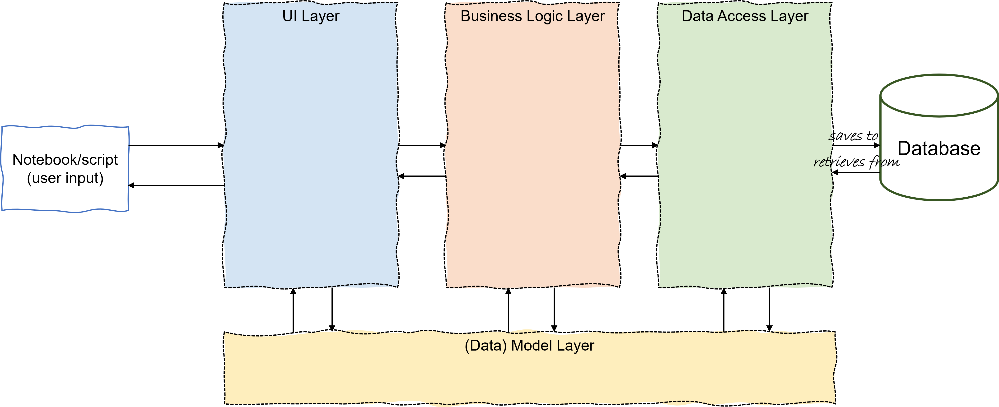

# Hotel-Reservierungssystem

### Das ist ein Hotelreservierungssystem Projekt der Gruppe B2

Das Hotelreservierungssystem umfasst einige Userstories aus der Aufgabenstellung die vorgegeben ist.
Das Modellierungskonzept wurde mittels Visual Paradigm erstellt. Die Datenbank wurd bereitgestellt und mit SQLite in Verbindung gebracht.
Die Projektstruktur wurde vorgegeben und wird auch n-Tier Struktur genannt. 

Im Vordergrund steht der UI-Layer, der sich um die Präsentation kümmert und alle Eingaben und Ausgaben der Benutzer steuert. Darauf folgt der Business-Logic-Layer, in dem alle Anwendungsregeln, Validierungen und Workflows umgesetzt werden – zum Beispiel die Logik zur Reservierungsprüfung oder Preisberechnung. Der Data-Access-Layer abstrahiert die konkrete Datenbankanbindung, führt CRUD-Operationen aus und stellt die rohen Daten bereit. Unterhalb dieser drei Schichten liegt der Model-Layer, der die fachlichen Objekte wie Hotel, Zimmer und Reservierung mit ihren Eigenschaften und Beziehungen definiert.

Durch diese klar getrennte Aufteilung können Änderungen an einer Schicht – etwa der Austausch der Datenbanktechnologie – vorgenommen werden, ohne dass andere Schichten angepasst werden müssen. Außerdem erleichtert diese Architektur das isolierte Testen der Geschäftsregeln und verbessert die Wartbarkeit insgesamt. Typischerweise fließt eine Benutzeranfrage vom UI-Layer in den Business-Logic-Layer, wird dort verarbeitet und bei Bedarf an den Data-Access-Layer weitergegeben, der die Datenbank kontaktiert. Die Antwort wandert dann in umgekehrter Reihenfolge zurück an die Benutzeroberfläche.

#### 1.  Datenbank-Layer
	•	Enthält die tatsächlichen SQLite-Dateien (DB-Storage).
	•	Schnittstelle: direktes Dateisystem, kein Python-Code hier.

#### 2. Model-Layer
	•	Zweck: Daten zwischen Schichten als Objekte transportieren.
	•	Klassen: Je Tabelle eine Datei <Entity>.py (z. B. Hotel.py, Booking.py).
	•	Inhalte: Properties und Getter/Setter für jedes Attribut der Tabelle.
	•	Wichtig: Neue Model-Klassen müssen in __init__.py importiert werden.

#### 3. Data-Access-Layer
	•	Zweck: CRUD-Operationen (INSERT, SELECT, UPDATE, DELETE) auf der DB ausführen.
	•	Klassen: Je Entity eine Datei <entity_name>_dal.py (z. B. hotel_dal.py).
	•	Inhalte: Sämtliche SQL-Statements und Datenbank-Verbindungen.
	•	Wichtig: Neue DAL-Klassen ebenfalls in __init__.py registrieren.

#### 4. Business-Logic-Layer
	•	Zweck: Anwendungs- bzw. Geschäftsregeln umsetzen (z. B. Preis-Berechnung, Validierungen).
	•	Klassen: Je Entity ein Manager <entity_name>_manager.py (z. B. booking_manager.py).
	•	Inhalte: Kombination und Vorbereitung von DAL-Aufrufen, Vor- und Nachbearbeitung von Daten für UI/DB.
	•	Wichtig: Auch hier neue Manager in __init__.py eintragen.

#### 5. UI-Layer
	•	Zweck: Nutzerinteraktion (Inputs abfragen, validieren, Ausgabe formatieren).
	•	Komponenten:
	•	Helper-Klasse für Input-Validierung.
	•	Deepnote-Notebooks für die finale Darstellung.
	
#### 6. •	Ablauf:
	1.	Eingaben entgegennehmen
	2.	Validieren (bei Fehlern Rückmeldung geben)
	3.	Über Business-Logic-Manager auf DAL zugreifen
	4.	Ergebnisse im Notebook anzeigen

## 👥 Team

Josip Jukic (GitHub: JJukic)

Libin Manavalan (GitHub: Libin2001)

Janarthanan Ragunathan(GitHub: Janaragu)

Selma Kaviani (GitHub: selmakaviani)
